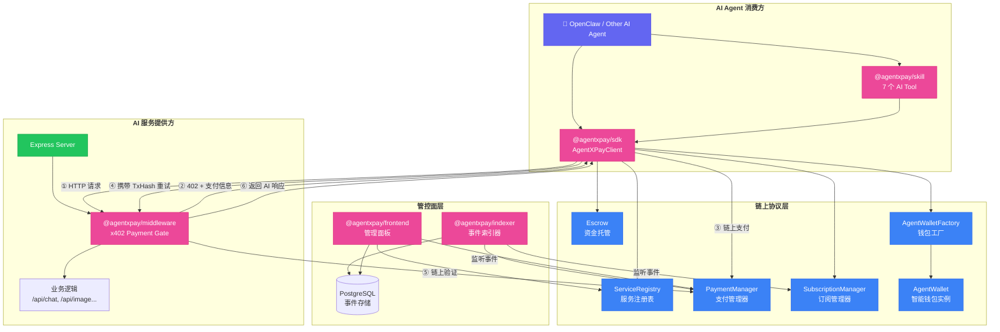
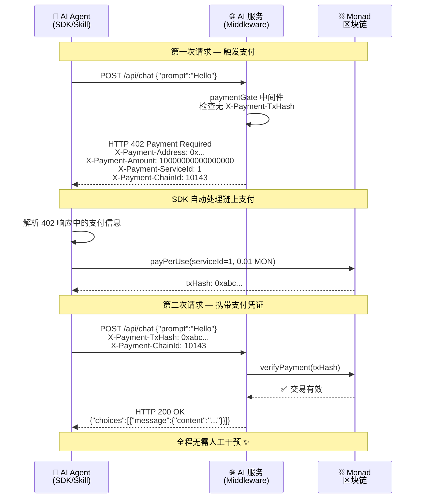
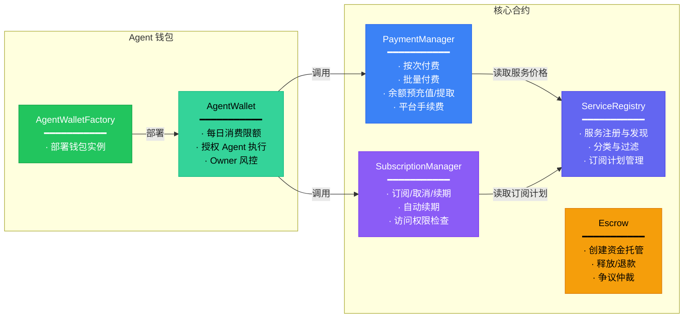
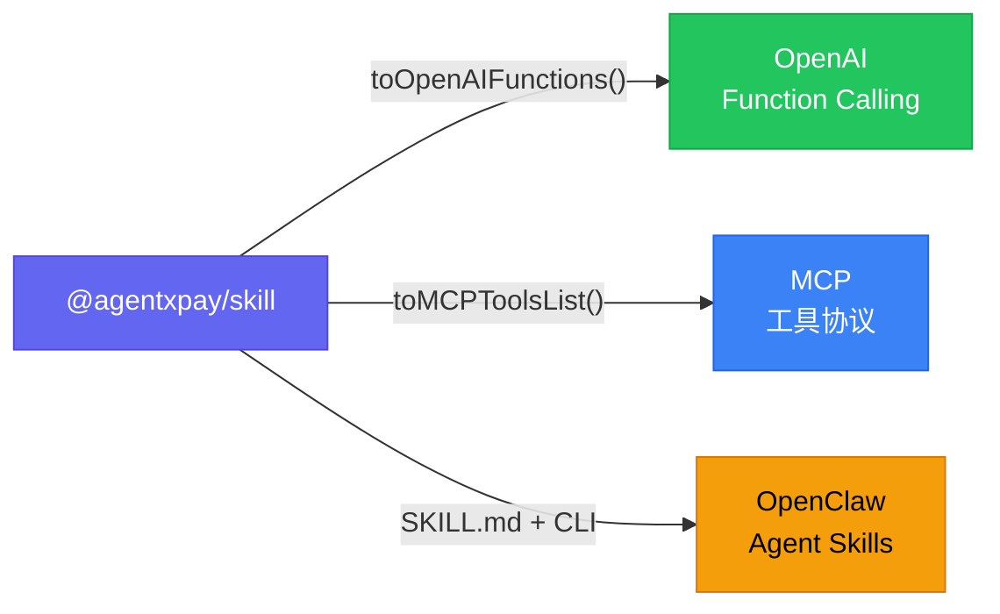
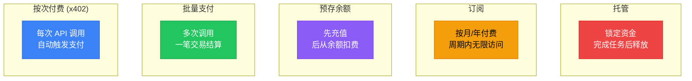
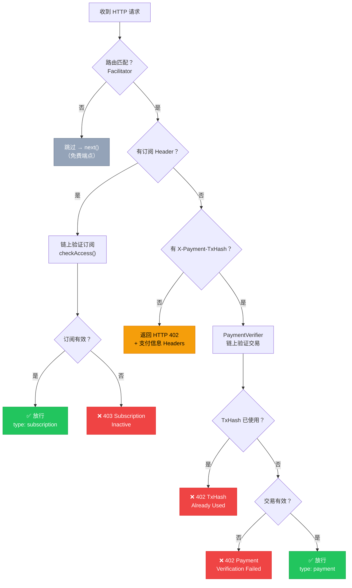

<div align="center">

# AgentXPay

### AI Agent 原生支付基础设施

**让 AI Agent 在 Monad 区块链上自主发现、支付和消费 AI 服务，全程无需人工干预**

[](./README_EN.md) · [架构设计](./docs/architecture.md) · [开发手册](./docs/development-guide.md) · [OpenClaw 集成](./docs/openclaw-integration.md)

</div>

---

## 项目简介

AgentXPay 是构建在 [Monad](https://www.monad.xyz/) 高性能 EVM 区块链上的 **AI-to-AI 支付协议栈**，核心实现了 **x402 协议** —— 基于 HTTP 402 状态码的自动化链上支付标准。

它为 AI Agent 经济体提供了从**服务注册、自动支付、订阅管理到资金托管**的完整闭环，让 AI Agent 自主发现、支付和消费 AI 服务，全程无需人工干预。

**相关链接**

- 项目仓库：https://github.com/AgentXPay
- SDK：https://www.npmjs.com/package/@agentxpay/sdk
- 中间件：https://www.npmjs.com/package/@agentxpay/middleware
- OpenClaw Skill：https://clawhub.ai/JasonRUAN/agentxpay
- 体验地址：https://agent-x-pay.vercel.app/

---

## 核心特性

- **x402 自动支付协议** — AI Agent 发送 HTTP 请求 → 收到 `402 Payment Required` → 自动链上支付 → 携带交易凭证重试 → 获取服务响应，全程零人工干预
- **链上服务市场** — 服务提供商在链上注册 AI 服务，Agent 可自主发现和选择最优服务
- **五种支付模式** — **按次付费、批量支付、预存余额、订阅包月、资金托管** — 覆盖全场景
- **Agent 智能钱包** — 支持每日消费限额的智能合约钱包，让 Agent 在预算内自主消费
- **即插即用集成** — Provider 只需添加一行中间件即可接入，Agent 只需引入 SDK 即可自动支付
- **多平台 Skill 支持** — 兼容 OpenAI Function Calling、MCP 工具协议和 OpenClaw Agent Skills 标准

---

## 架构总览

AgentXPay 围绕 **x402 协议** 实现 AI Agent 自主支付闭环，分为四层：

- **链上协议层**：6 个 Solidity 智能合约构成完整支付协议栈
- **管控面层**：后端事件索引器实时监听链上事件并落库，前端管理面板提供服务管理、账单查询和数据可视化
- **AI 服务提供方**：一行代码集成中间件，将任意 API 转为付费接口，中间件负责返回 402、校验链上支付凭证并放行请求
- **AI Agent 消费方**：通过集成 SDK 或 Skill 工具包发起服务调用，SDK 内置 x402 感知能力，自动完成 **"请求 → 402 → 支付 → 重试"** 全流程



---

## x402 协议

x402 协议是 AgentXPay 的核心创新，基于 HTTP 402（Payment Required）状态码实现自动化链上支付，支持多链和多币种：



### x402 HTTP Headers 规范

| Header | 方向 | 说明 |
|--------|------|------|
| `X-Payment-Address` | Server → Agent | PaymentManager 合约地址 |
| `X-Payment-Amount` | Server → Agent | 所需金额（Wei） |
| `X-Payment-Token` | Server → Agent | 代币类型（`native`） |
| `X-Payment-ServiceId` | Server → Agent | 链上服务 ID |
| `X-Payment-ChainId` | Server → Agent | 链 ID（10143） |
| `X-Payment-TxHash` | Agent → Server | 链上支付交易哈希 |
| `X-Subscription-Address` | Agent → Server | 订阅者地址（用于订阅免付费访问） |

---

## 智能合约

基于 Solidity 0.8.20 + Foundry + OpenZeppelin 构建的链上协议，由 6 个合约组成：



| 合约 | 功能 | 关键函数 |
|------|------|---------|
| **ServiceRegistry** | 服务注册、发现、分类、订阅计划管理 | `registerService()`, `getService()`, `addSubscriptionPlan()` |
| **PaymentManager** | 按次/批量/余额支付，手续费抽成 | `payPerUse()`, `batchPay()`, `deposit()`, `withdraw()` |
| **SubscriptionManager** | 订阅管理和访问权限检查 | `subscribe()`, `cancel()`, `renew()`, `checkAccess()` |
| **Escrow** | 资金托管、争议仲裁 | `createEscrow()`, `release()`, `dispute()`, `refund()` |
| **AgentWalletFactory** | 部署 Agent 钱包实例 | `createWallet()` |
| **AgentWallet** | 每日限额控制的智能钱包 | `execute()`, `setDailyLimit()`, `authorizeAgent()` |

---

## AI Agent Skill

`@agentxpay/skill` 让 LLM Agent 通过 Function Calling 自主使用支付能力，提供 **7 个 AI Tool**：

| Tool | 功能 |
|------|------|
| `agentxpay_smart_call` | 智能一步到位：发现 → 选择 → 付费 → 调用 |
| `agentxpay_discover_services` | 链上服务发现 |
| `agentxpay_pay_and_call` | x402 自动付费调用 |
| `agentxpay_manage_wallet` | Agent 钱包管理（创建/充值/限额） |
| `agentxpay_subscribe` | 订阅服务计划 |
| `agentxpay_create_escrow` | 创建资金托管 |
| `agentxpay_get_agent_info` | 查询 Agent 状态 |

### 多平台兼容

Skill 同时支持三种主流集成方式：



---

## 五种支付模式

AgentXPay 支持五种支付模式，覆盖不同使用场景：



| 模式 | 适用场景 | 实现方式 |
|------|----------|----------|
| **按次付费 (x402)** | 低频调用、首次使用 | `client.fetch()` → 402 → `payPerUse()` → 重试 |
| **批量支付** | 已知多次调用 | `payments.batchPay(serviceIds[], totalAmount)` |
| **预存余额** | 高频使用 | `payments.deposit()` → `payments.payFromBalance()` |
| **订阅** | 固定周期大量使用 | `subscriptions.subscribe()` → 中间件 `checkAccess()` 放行 |
| **托管** | 定制化任务 | `escrow.createEscrow()` → 完成后 `releaseEscrow()` |

---

## 中间件工作流

`@agentxpay/middleware` 让任何 Express 服务一行代码变成付费 API，内部处理流程：



---

## 项目结构

```
AgentXPay/
├── contracts/                          # Solidity 智能合约 (Foundry + OpenZeppelin)
│   ├── src/
│   │   ├── interfaces/                 # 合约接口定义
│   │   │   ├── IAgentWallet.sol
│   │   │   ├── IEscrow.sol
│   │   │   ├── IPaymentManager.sol
│   │   │   ├── IServiceRegistry.sol
│   │   │   └── ISubscriptionManager.sol
│   │   ├── libraries/
│   │   │   └── PaymentLib.sol          # 支付工具库
│   │   ├── AgentWallet.sol             # Agent 智能钱包
│   │   ├── AgentWalletFactory.sol      # 钱包工厂
│   │   ├── Escrow.sol                  # 资金托管
│   │   ├── PaymentManager.sol          # 支付管理器
│   │   ├── ServiceRegistry.sol         # 服务注册表
│   │   └── SubscriptionManager.sol     # 订阅管理器
│   ├── script/
│   │   └── Deploy.s.sol                # 部署脚本
│   ├── test/                           # 合约测试
│   ├── deployments.json                # 已部署合约地址
│   └── foundry.toml
│
├── AgentXPay/                          # pnpm monorepo + Turborepo
│   ├── sdk/                            # @agentxpay/sdk — 核心客户端库
│   │   └── src/
│   │       ├── abi/                    # 合约 ABI (6 个 JSON)
│   │       ├── modules/                # 功能模块
│   │       │   ├── escrow.ts           # 资金托管
│   │       │   ├── payments.ts         # 支付（按次/批量/余额）
│   │       │   ├── services.ts         # 服务发现与注册
│   │       │   ├── subscriptions.ts    # 订阅管理
│   │       │   └── wallet.ts           # Agent 钱包
│   │       ├── types/
│   │       ├── utils/
│   │       ├── AgentXPayClient.ts      # 主客户端入口
│   │       └── index.ts
│   │
│   ├── middleware/                      # @agentxpay/middleware — x402 Express 中间件
│   │   └── src/
│   │       ├── facilitator.ts          # 路由匹配与支付信息
│   │       ├── paymentGate.ts          # x402 支付网关中间件
│   │       ├── verifier.ts             # 链上交易验证
│   │       ├── server.ts               # Express 服务入口
│   │       ├── types.ts
│   │       └── index.ts
│   │
│   ├── indexer/                         # @agentxpay/indexer — 链上事件索引器 + REST API
│   │   └── src/
│   │       ├── indexer.ts              # 事件监听与索引
│   │       ├── api.ts                  # REST API 服务
│   │       ├── db.ts                   # PostgreSQL 数据库
│   │       ├── config.ts
│   │       ├── types.ts
│   │       └── index.ts
│   │
│   ├── frontend/                        # @agentxpay/frontend — Next.js 管理面板
│   │   └── src/
│   │       ├── app/
│   │       │   ├── dashboard/
│   │       │   │   ├── agent/          # Agent 钱包管理
│   │       │   │   ├── billing/        # 账单与支付记录
│   │       │   │   ├── playground/     # API 调试面板
│   │       │   │   └── services/       # 服务管理
│   │       │   ├── layout.tsx
│   │       │   └── page.tsx
│   │       ├── components/
│   │       │   ├── layout/             # Header, Sidebar
│   │       │   ├── ui/                 # shadcn/ui 组件 (12 个)
│   │       │   └── TryServiceDialog.tsx
│   │       ├── hooks/                  # 12 个自定义 Hooks
│   │       ├── abi/                    # 合约 ABI
│   │       ├── constants/              # 合约地址与配置
│   │       ├── lib/                    # monadChain, utils
│   │       └── providers/              # Web3Provider (wagmi + RainbowKit)
│   │
│   ├── docs/                           # 项目文档
│   │   ├── architecture.md             # 架构设计
│   │   ├── development-guide.md        # 开发手册
│   │   └── openclaw-integration.md     # OpenClaw 集成指南
│   │
│   ├── pnpm-workspace.yaml
│   └── turbo.json
│
├── skills/                             # AI Agent Skill
│   └── agentxpay/                      # @agentxpay/skill — 7 个 AI Tool
│       ├── src/
│       │   ├── runtime.ts              # 工具运行时
│       │   ├── schemas.ts             # 工具参数定义
│       │   ├── types.ts
│       │   └── index.ts
│       ├── scripts/
│       │   └── run-tool.ts            # CLI 运行脚本
│       ├── references/                 # 参考文档
│       │   ├── sdk-api.md
│       │   └── x402-protocol.md
│       └── SKILL.md                   # OpenClaw Skill 描述
│
├── examples/                           # 示例项目
│   └── provider-demo/                  # AI 服务提供方示例
│       └── src/
│           └── server.ts               # Express + x402 中间件示例
│
├── docker-run.sh                       # Docker 运行脚本
└── tee-docker-compose.yml              # TEE Docker 编排
```

---

## 合约地址

> 当前已发布到：`Monad Testnet`
>
> - Chain ID：10143
>
> - RPC: `https://testnet-rpc.monad.xyz/`

| 合约 | 地址 |
|------|------|
| ServiceRegistry | `0x6F9679BdF5F180a139d01c598839a5df4860431b` |
| PaymentManager | `0xf4AE7E15B1012edceD8103510eeB560a9343AFd3` |
| SubscriptionManager | `0x0bF7dE8d71820840063D4B8653Fd3F0618986faF` |
| Escrow | `0xc981ec845488b8479539e6B22dc808Fb824dB00a` |
| AgentWalletFactory | `0x5E5713a0d915701F464DEbb66015adD62B2e6AE9` |

---

## 技术栈

| 层级 | 技术 |
|------|------|
| **区块链** | Monad Testnet (chainId 10143), Solidity 0.8.20, Foundry, OpenZeppelin |
| **SDK** | TypeScript, ethers.js v6, tsup |
| **中间件** | TypeScript, Express.js, LRU Cache |
| **索引器** | TypeScript, PostgreSQL 16, Express.js |
| **前端** | Next.js 14, React 18, wagmi, viem, RainbowKit, Tailwind CSS, shadcn/ui |
| **Skill** | TypeScript, OpenAI Function Calling / MCP / OpenClaw 兼容 |
| **构建** | pnpm workspaces, Turborepo |

---

## 详细文档

| 文档 | 说明 |
|------|------|
| [架构设计](./docs/architecture.md) | 完整架构、x402 协议、合约设计、各组件详解 |
| [SDK & 中间件开发手册](./docs/development-guide.md) | Agent 集成 SDK + Provider 集成 Middleware 完整指南 |
| [OpenClaw 集成手册](./docs/openclaw-integration.md) | 将 AgentXPay Skill 接入 OpenClaw 平台 |

