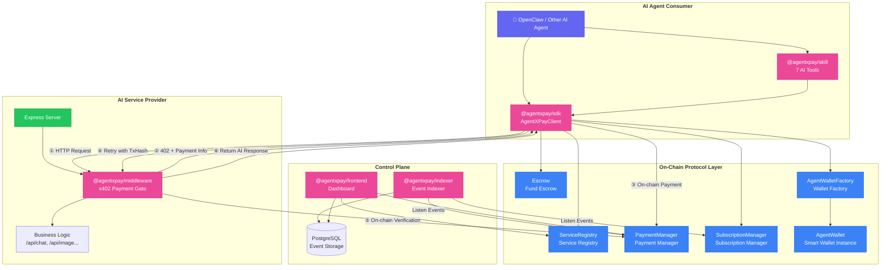
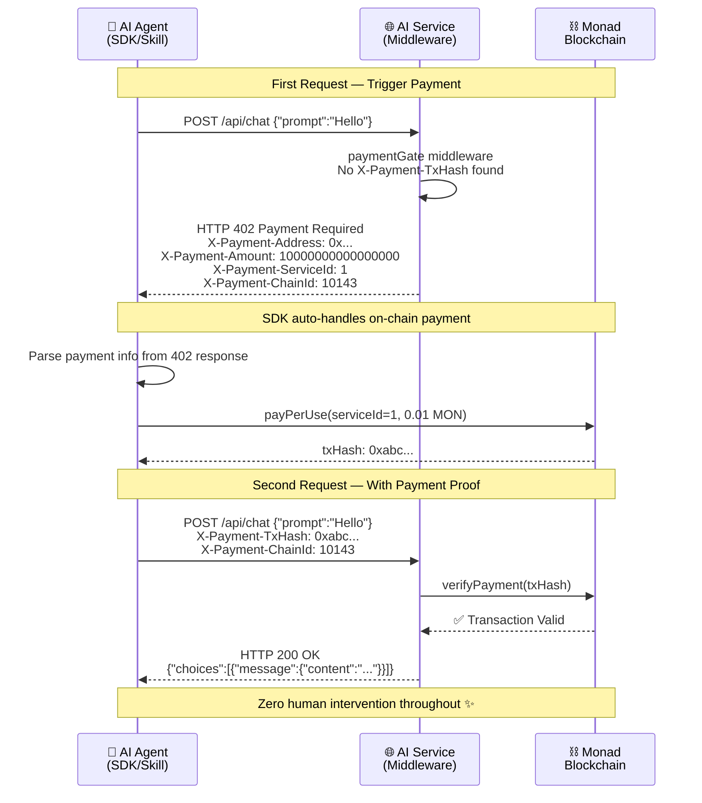
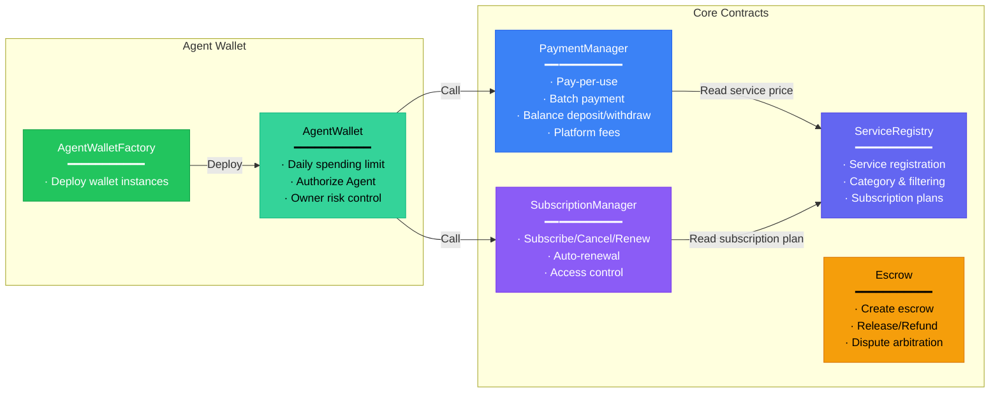
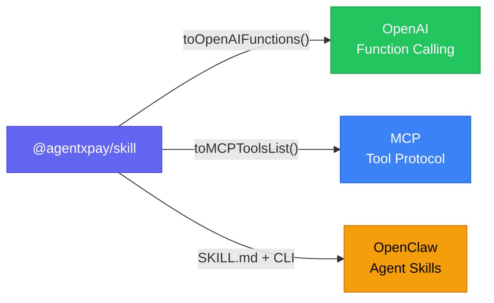
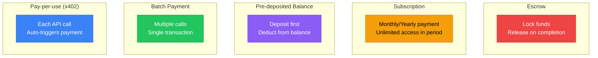
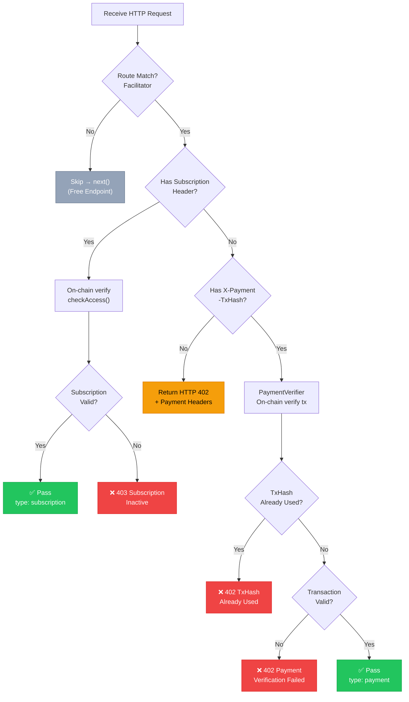

<div align="center">

# AgentXPay

### AI Agent Native Payment Infrastructure

**Enable AI Agents to autonomously discover, pay for, and consume AI services on Monad blockchain — zero human intervention**

[](./README.md) · [Architecture](./docs/architecture.md) · [Dev Guide](./docs/development-guide.md) · [OpenClaw Integration](./docs/openclaw-integration.md)

</div>

---

## Overview

AgentXPay is an **AI-to-AI payment protocol stack** built on [Monad](https://www.monad.xyz/) high-performance EVM blockchain. At its core is the **x402 Protocol** — an automated on-chain payment standard based on the HTTP 402 status code.

It provides a complete closed-loop for the AI Agent economy — from **service registration, automatic payment, subscription management to fund escrow** — enabling AI Agents to autonomously discover, pay for, and consume AI services with zero human intervention.

**Links**

- Repository: https://github.com/AgentXPay
- SDK: https://www.npmjs.com/package/@agentxpay/sdk
- Middleware: https://www.npmjs.com/package/@agentxpay/middleware
- OpenClaw Skill: https://clawhub.ai/JasonRUAN/agentxpay
- Demo: https://agent-x-pay.vercel.app/

---

## Key Features

- **x402 Auto-Payment Protocol** — Agent sends HTTP request → receives `402 Payment Required` → auto on-chain payment → retries with tx proof → gets response, all with zero human intervention
- **On-Chain Service Marketplace** — Providers register AI services on-chain; Agents autonomously discover and select optimal services
- **Five Payment Modes** — **Pay-per-use, Batch payment, Pre-deposited balance, Subscription, Escrow** — covering all scenarios
- **Agent Smart Wallet** — Smart contract wallet with daily spending limits for autonomous Agent consumption within budget
- **Plug-and-Play Integration** — One-line middleware for Providers, SDK import for Agents
- **Multi-Platform Skill Support** — Compatible with OpenAI Function Calling, MCP Tool Protocol, and OpenClaw Agent Skills

---

## Architecture Overview

AgentXPay implements an AI Agent autonomous payment loop around the **x402 Protocol**, consisting of four layers:

- **On-Chain Protocol Layer**: 6 Solidity smart contracts forming a complete payment protocol stack
- **Control Plane Layer**: Backend event indexer monitoring on-chain events in real-time, frontend dashboard for service management, billing, and data visualization
- **AI Service Provider**: One-line middleware integration turns any API into a paid endpoint; the middleware handles 402 responses, on-chain payment verification, and request forwarding
- **AI Agent Consumer**: Integrates SDK or Skill toolkit to call services; SDK has built-in x402 awareness, automatically completing the **"Request → 402 → Pay → Retry"** flow



---

## x402 Protocol

The x402 Protocol is the core innovation of AgentXPay, implementing automated on-chain payment based on the HTTP 402 (Payment Required) status code, with multi-chain and multi-token support:



### x402 HTTP Headers

| Header | Direction | Description |
|--------|-----------|-------------|
| `X-Payment-Address` | Server → Agent | PaymentManager contract address |
| `X-Payment-Amount` | Server → Agent | Required amount (Wei) |
| `X-Payment-Token` | Server → Agent | Token type (`native`) |
| `X-Payment-ServiceId` | Server → Agent | On-chain service ID |
| `X-Payment-ChainId` | Server → Agent | Chain ID (10143) |
| `X-Payment-TxHash` | Agent → Server | On-chain payment tx hash |
| `X-Subscription-Address` | Agent → Server | Subscriber address (for subscription-based free access) |

---

## Smart Contracts

On-chain protocol built with Solidity 0.8.20 + Foundry + OpenZeppelin, consisting of 6 contracts:



| Contract | Function | Key Methods |
|----------|----------|-------------|
| **ServiceRegistry** | Service registration, discovery, categorization | `registerService()`, `getService()`, `addSubscriptionPlan()` |
| **PaymentManager** | Per-use/Batch/Balance payment, fee collection | `payPerUse()`, `batchPay()`, `deposit()`, `withdraw()` |
| **SubscriptionManager** | Subscription management and access control | `subscribe()`, `cancel()`, `renew()`, `checkAccess()` |
| **Escrow** | Fund escrow, dispute arbitration | `createEscrow()`, `release()`, `dispute()`, `refund()` |
| **AgentWalletFactory** | Deploy Agent wallet instances | `createWallet()` |
| **AgentWallet** | Daily-limit smart wallet | `execute()`, `setDailyLimit()`, `authorizeAgent()` |

---

## AI Agent Skill

`@agentxpay/skill` enables LLM Agents to autonomously use payment capabilities via Function Calling, providing **7 AI Tools**:

| Tool | Function |
|------|----------|
| `agentxpay_smart_call` | All-in-one: Discover → Select → Pay → Call |
| `agentxpay_discover_services` | On-chain service discovery |
| `agentxpay_pay_and_call` | x402 auto-payment call |
| `agentxpay_manage_wallet` | Agent wallet management (create/fund/limit) |
| `agentxpay_subscribe` | Subscribe to service plans |
| `agentxpay_create_escrow` | Create fund escrow |
| `agentxpay_get_agent_info` | Query Agent status |

### Multi-Platform Compatibility

Skill supports three mainstream integration methods:



---

## Five Payment Modes

AgentXPay supports five payment modes covering different usage scenarios:



| Mode | Use Case | Implementation |
|------|----------|----------------|
| **Pay-per-use (x402)** | Low-frequency, first use | `client.fetch()` → 402 → `payPerUse()` → retry |
| **Batch Payment** | Known multiple calls | `payments.batchPay(serviceIds[], totalAmount)` |
| **Pre-deposited Balance** | High-frequency usage | `payments.deposit()` → `payments.payFromBalance()` |
| **Subscription** | Fixed-period heavy use | `subscriptions.subscribe()` → middleware `checkAccess()` pass |
| **Escrow** | Custom tasks | `escrow.createEscrow()` → `releaseEscrow()` on completion |

---

## Middleware Workflow

`@agentxpay/middleware` turns any Express service into a paid API with one line of code. Internal processing flow:



---

## Project Structure

```
AgentXPay/
├── contracts/                          # Solidity 智能合约 (Foundry + OpenZeppelin)
│   ├── src/
│   │   ├── interfaces/                 # 合约接口定义
│   │   │   ├── IAgentWallet.sol
│   │   │   ├── IEscrow.sol
│   │   │   ├── IPaymentManager.sol
│   │   │   ├── IServiceRegistry.sol
│   │   │   └── ISubscriptionManager.sol
│   │   ├── libraries/
│   │   │   └── PaymentLib.sol          # 支付工具库
│   │   ├── AgentWallet.sol             # Agent 智能钱包
│   │   ├── AgentWalletFactory.sol      # 钱包工厂
│   │   ├── Escrow.sol                  # 资金托管
│   │   ├── PaymentManager.sol          # 支付管理器
│   │   ├── ServiceRegistry.sol         # 服务注册表
│   │   └── SubscriptionManager.sol     # 订阅管理器
│   ├── script/
│   │   └── Deploy.s.sol                # 部署脚本
│   ├── test/                           # 合约测试
│   ├── deployments.json                # 已部署合约地址
│   └── foundry.toml
│
├── AgentXPay/                          # pnpm monorepo + Turborepo
│   ├── sdk/                            # @agentxpay/sdk — 核心客户端库
│   │   └── src/
│   │       ├── abi/                    # 合约 ABI (6 个 JSON)
│   │       ├── modules/                # 功能模块
│   │       │   ├── escrow.ts           # 资金托管
│   │       │   ├── payments.ts         # 支付（按次/批量/余额）
│   │       │   ├── services.ts         # 服务发现与注册
│   │       │   ├── subscriptions.ts    # 订阅管理
│   │       │   └── wallet.ts           # Agent 钱包
│   │       ├── types/
│   │       ├── utils/
│   │       ├── AgentXPayClient.ts      # 主客户端入口
│   │       └── index.ts
│   │
│   ├── middleware/                      # @agentxpay/middleware — x402 Express 中间件
│   │   └── src/
│   │       ├── facilitator.ts          # 路由匹配与支付信息
│   │       ├── paymentGate.ts          # x402 支付网关中间件
│   │       ├── verifier.ts             # 链上交易验证
│   │       ├── server.ts               # Express 服务入口
│   │       ├── types.ts
│   │       └── index.ts
│   │
│   ├── indexer/                         # @agentxpay/indexer — 链上事件索引器 + REST API
│   │   └── src/
│   │       ├── indexer.ts              # 事件监听与索引
│   │       ├── api.ts                  # REST API 服务
│   │       ├── db.ts                   # PostgreSQL 数据库
│   │       ├── config.ts
│   │       ├── types.ts
│   │       └── index.ts
│   │
│   ├── frontend/                        # @agentxpay/frontend — Next.js 管理面板
│   │   └── src/
│   │       ├── app/
│   │       │   ├── dashboard/
│   │       │   │   ├── agent/          # Agent 钱包管理
│   │       │   │   ├── billing/        # 账单与支付记录
│   │       │   │   ├── playground/     # API 调试面板
│   │       │   │   └── services/       # 服务管理
│   │       │   ├── layout.tsx
│   │       │   └── page.tsx
│   │       ├── components/
│   │       │   ├── layout/             # Header, Sidebar
│   │       │   ├── ui/                 # shadcn/ui 组件 (12 个)
│   │       │   └── TryServiceDialog.tsx
│   │       ├── hooks/                  # 12 个自定义 Hooks
│   │       ├── abi/                    # 合约 ABI
│   │       ├── constants/              # 合约地址与配置
│   │       ├── lib/                    # monadChain, utils
│   │       └── providers/              # Web3Provider (wagmi + RainbowKit)
│   │
│   ├── docs/                           # 项目文档
│   │   ├── architecture.md             # 架构设计
│   │   ├── development-guide.md        # 开发手册
│   │   └── openclaw-integration.md     # OpenClaw 集成指南
│   │
│   ├── pnpm-workspace.yaml
│   └── turbo.json
│
├── skills/                             # AI Agent Skill
│   └── agentxpay/                      # @agentxpay/skill — 7 个 AI Tool
│       ├── src/
│       │   ├── runtime.ts              # 工具运行时
│       │   ├── schemas.ts             # 工具参数定义
│       │   ├── types.ts
│       │   └── index.ts
│       ├── scripts/
│       │   └── run-tool.ts            # CLI 运行脚本
│       ├── references/                 # 参考文档
│       │   ├── sdk-api.md
│       │   └── x402-protocol.md
│       └── SKILL.md                   # OpenClaw Skill 描述
│
├── examples/                           # 示例项目
│   └── provider-demo/                  # AI 服务提供方示例
│       └── src/
│           └── server.ts               # Express + x402 中间件示例
│
├── docker-run.sh                       # Docker 运行脚本
└── tee-docker-compose.yml              # TEE Docker 编排
```

---

## Contract Addresses (Monad Testnet · Chain ID 10143)

| Contract | Address |
|----------|---------|
| ServiceRegistry | `0x6F9679BdF5F180a139d01c598839a5df4860431b` |
| PaymentManager | `0xf4AE7E15B1012edceD8103510eeB560a9343AFd3` |
| SubscriptionManager | `0x0bF7dE8d71820840063D4B8653Fd3F0618986faF` |
| Escrow | `0xc981ec845488b8479539e6B22dc808Fb824dB00a` |
| AgentWalletFactory | `0x5E5713a0d915701F464DEbb66015adD62B2e6AE9` |

> RPC: `https://testnet-rpc.monad.xyz/`

---

## Tech Stack

| Layer | Technology |
|-------|------------|
| **Blockchain** | Monad Testnet (chainId 10143), Solidity 0.8.20, Foundry, OpenZeppelin |
| **SDK** | TypeScript, ethers.js v6, tsup |
| **Middleware** | TypeScript, Express.js, LRU Cache |
| **Indexer** | TypeScript, PostgreSQL 16, Express.js |
| **Frontend** | Next.js 14, React 18, wagmi, viem, RainbowKit, Tailwind CSS, shadcn/ui |
| **Skill** | TypeScript, OpenAI Function Calling / MCP / OpenClaw compatible |
| **Build** | pnpm workspaces, Turborepo |

---

## Documentation

| Document | Description |
|----------|-------------|
| [Architecture](./docs/architecture.md) | Full architecture, x402 protocol, contract design, component details |
| [SDK & Middleware Dev Guide](./docs/development-guide.md) | Agent SDK integration + Provider Middleware integration guide |
| [OpenClaw Integration](./docs/openclaw-integration.md) | Integrating AgentXPay Skill into the OpenClaw platform |
