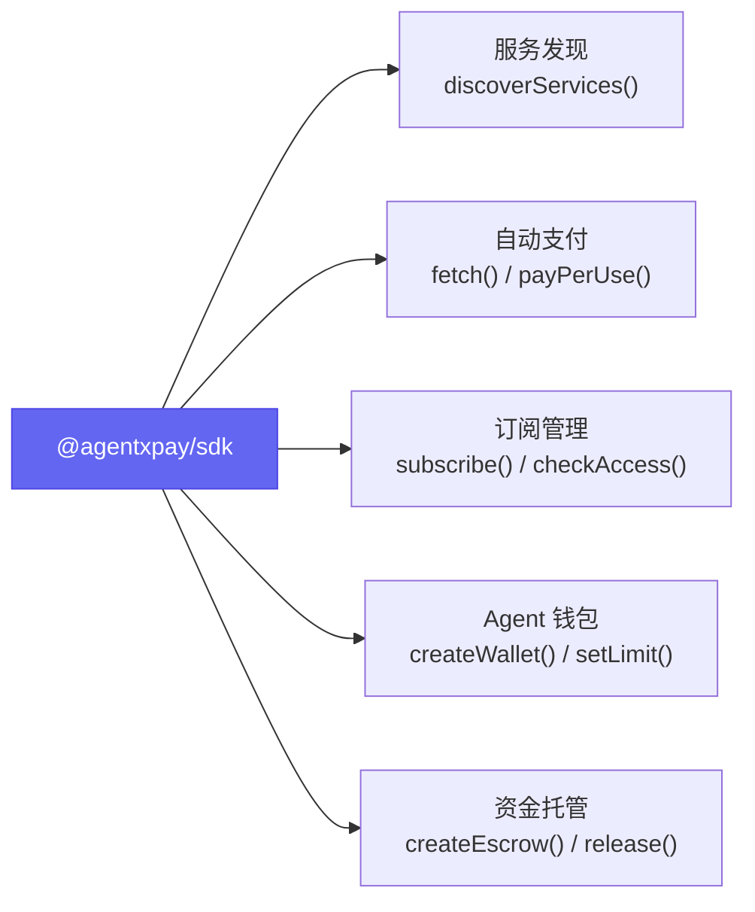
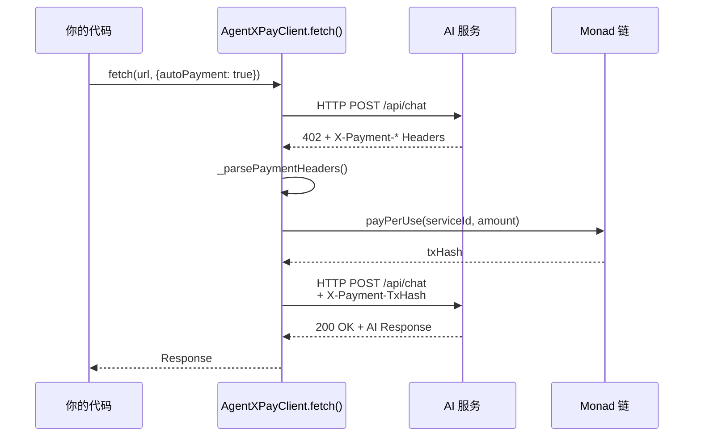
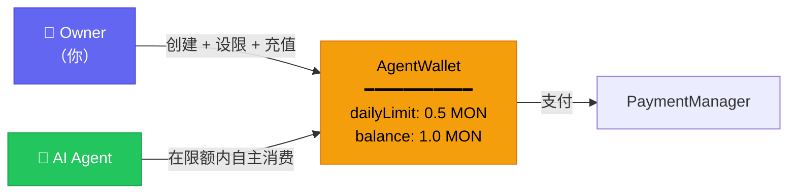
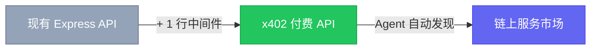
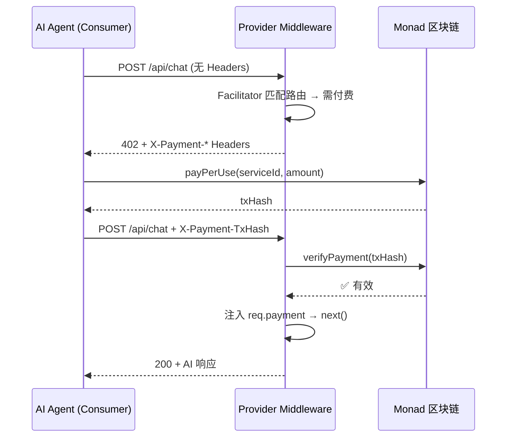
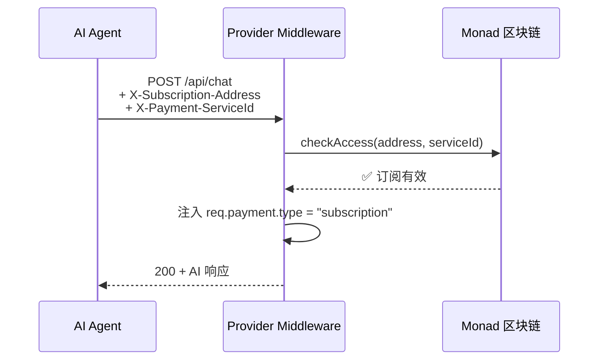
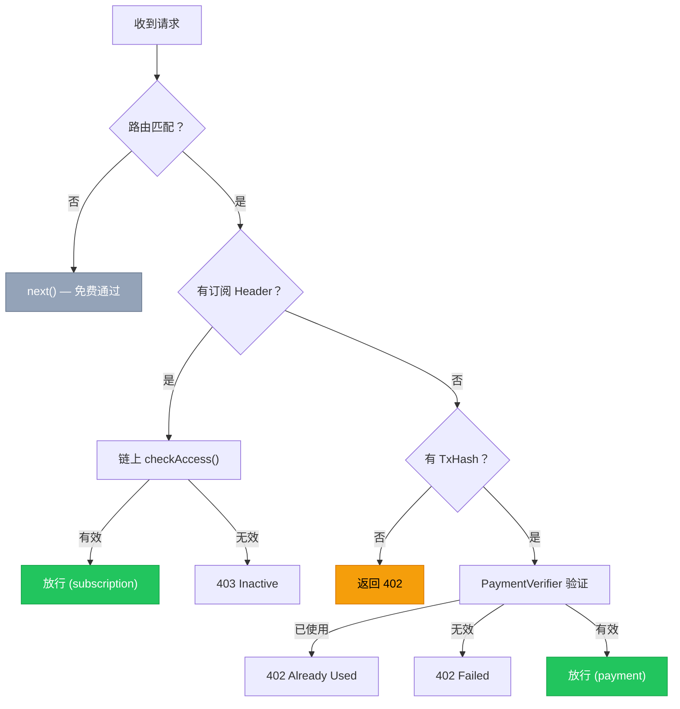

# AgentXPay SDK&中间件集成开发手册

> 本手册面向两类开发者：**Agent 开发者**（集成 `@agentxpay/sdk` 让 AI Agent 自主付费调用服务）和 **Provider 开发者**（集成 `@agentxpay/middleware` 将 API 变为付费服务）。

---

# 目录

[TOC]

---

# Part 1: Agent 开发（集成 SDK）

## 1.1 概述

`@agentxpay/sdk` 让 AI Agent 具备以下链上能力：



**核心价值**：Agent 调用 `client.fetch(url)` 时，SDK 自动处理 HTTP 402 → 链上支付 → 携带凭证重试的完整流程，实现零人工干预的 AI-to-AI 支付。

## 1.2 快速开始

### 安装

```bash
npm install @agentxpay/sdk ethers
```

### 初始化客户端

```typescript
import { AgentXPayClient } from "@agentxpay/sdk";

const client = new AgentXPayClient({
  rpcUrl: "https://testnet-rpc.monad.xyz/",
  privateKey: process.env.PRIVATE_KEY,
  contracts: {
    serviceRegistry: "0x6F9679BdF5F180a139d01c598839a5df4860431b",
    paymentManager: "0xf4AE7E15B1012edceD8103510eeB560a9343AFd3",
    subscriptionManager: "0x0bF7dE8d71820840063D4B8653Fd3F0618986faF",  // 可选
    escrow: "0xc981ec845488b8479539e6B22dc808Fb824dB00a",              // 可选
    agentWalletFactory: "0x5E5713a0d915701F464DEbb66015adD62B2e6AE9",   // 可选
  },
  network: "testnet",
});
```

### 五行代码调用付费 AI 服务

```typescript
// SDK 自动处理 402 → 链上支付 → 重试
const response = await client.fetch("https://provider.com/api/chat", {
  method: "POST",
  headers: { "Content-Type": "application/json" },
  body: JSON.stringify({ prompt: "What is DeFi?" }),
  autoPayment: true,
});

const data = await response.json();
console.log(data.choices[0].message.content);
```

## 1.3 核心能力：x402 自动支付

`client.fetch()` 是 SDK 最核心的 API，它在标准 `fetch()` 基础上增加了 x402 支付能力：



**参数说明**：

```typescript
const response = await client.fetch(url, {
  method: "POST",                              // HTTP 方法
  headers: { "Content-Type": "application/json" },
  body: JSON.stringify({ prompt: "..." }),      // 请求体
  autoPayment: true,                           // 启用自动支付（默认 true）
});
```

**返回值**：标准 `Response` 对象，可直接 `.json()` / `.text()` 解析。

## 1.4 服务发现

```typescript
// 查询所有服务
const allServices = await client.discoverServices({});

// 按分类过滤
const llmServices = await client.discoverServices({ category: "LLM" });

// 按最高价格过滤
const cheapServices = await client.discoverServices({
  maxPrice: ethers.parseEther("0.02"),
});

// 查询单个服务详情
const service = await client.services.getServiceDetails(1n);
console.log(`${service.name} — ${ethers.formatEther(service.pricePerCall)} MON/call`);

// 查询服务的订阅计划
const plans = await client.services.getSubscriptionPlans(1n);
for (const plan of plans) {
  console.log(`${plan.name}: ${ethers.formatEther(plan.price)} MON / ${plan.duration}s`);
}
```

**Service 对象结构**：

```typescript
interface Service {
  id: bigint;            // 链上服务 ID
  provider: string;      // Provider 钱包地址
  name: string;          // 服务名称
  description: string;   // 服务描述
  endpoint: string;      // API 端点 URL
  category: string;      // 分类（LLM, Image, Code 等）
  pricePerCall: bigint;  // 每次调用价格（Wei）
  isActive: boolean;     // 是否激活
  createdAt: bigint;     // 创建时间
}
```

## 1.5 支付模块

### 按次付费（x402 自动处理）

```typescript
// 方式 1：通过 fetch 自动支付（推荐）
const response = await client.fetch(serviceEndpoint, { autoPayment: true });

// 方式 2：手动支付
const result = await client.payments.payPerUse(
  1n,                                  // serviceId
  ethers.parseEther("0.01")            // amount
);
console.log(`Paid! TxHash: ${result.txHash}`);
```

### 批量支付

一笔交易结算多次服务调用：

```typescript
const txHash = await client.payments.batchPay(
  [1n, 1n, 2n, 3n],                   // serviceIds（可重复）
  ethers.parseEther("0.055")           // 总金额
);
```

### 预存余额

先充值、后从余额扣费，适合高频使用：

```typescript
// 充值 1 MON
await client.payments.deposit(ethers.parseEther("1.0"));

// 从余额支付
await client.payments.payFromBalance(1n);  // serviceId

// 查询余额
const balance = await client.payments.getBalance(walletAddress);

// 提取余额
await client.payments.withdraw(ethers.parseEther("0.5"));
```

## 1.6 订阅管理

```typescript
// 订阅服务
const result = await client.subscribe(
  1n,                                  // serviceId
  0n,                                  // planId
  ethers.parseEther("0.5")             // 订阅费
);
console.log(`Subscription ID: ${result.subscriptionId}`);

// 检查访问权限
const hasAccess = await client.subscriptions.checkAccess(
  walletAddress,
  1n                                   // serviceId
);

// 取消订阅
await client.subscriptions.cancelSubscription(result.subscriptionId);

// 续费
await client.subscriptions.renewSubscription(
  result.subscriptionId,
  ethers.parseEther("0.5")
);
```

## 1.7 Agent 钱包

Agent 钱包是部署在链上的智能合约，支持每日消费限额控制：



```typescript
// 创建 Agent 钱包（每日限额 0.5 MON）
const walletResult = await client.wallet.createWallet(
  ethers.parseEther("0.5")
);
console.log(`Wallet: ${walletResult.walletAddress}`);

// 向钱包充值
const provider = new ethers.JsonRpcProvider(rpcUrl);
const signer = new ethers.Wallet(privateKey, provider);
const tx = await signer.sendTransaction({
  to: walletResult.walletAddress,
  value: ethers.parseEther("1.0"),
});
await tx.wait();

// 查询已创建的钱包
const wallets = await client.wallet.getWallets(ownerAddress);
```

## 1.8 资金托管

适用于定制化 AI 任务（如模型微调），资金先锁定，任务完成后释放：

```typescript
// 创建托管
const escrowResult = await client.escrow.createEscrow(
  1n,                                              // serviceId
  "0xProviderAddress",                             // provider 地址
  BigInt(Math.floor(Date.now() / 1000) + 7 * 86400),  // 7 天后截止
  "Custom model fine-tuning",                      // 任务描述
  ethers.parseEther("0.1")                         // 托管金额
);

// 任务完成后释放资金（由 payer 或 provider 调用）
await client.escrow.releaseEscrow(escrowResult.escrowId);

// 发起争议
await client.escrow.disputeEscrow(escrowResult.escrowId);

// 退款
await client.escrow.refundEscrow(escrowResult.escrowId);
```

## 1.9 SDK API 参考

### AgentXPayConfig

```typescript
interface AgentXPayConfig {
  rpcUrl: string;                              // Monad RPC URL
  privateKey?: string;                         // 私钥（与 signer 二选一）
  signer?: any;                                // ethers.Signer 实例
  contracts?: ContractAddresses;               // 合约地址覆盖
  network?: "local" | "testnet" | "mainnet";   // 网络
}

interface ContractAddresses {
  serviceRegistry?: string;
  paymentManager?: string;
  subscriptionManager?: string;
  escrow?: string;
  agentWalletFactory?: string;
}
```

### 返回值类型

```typescript
interface PaymentResult {
  txHash: string;
  serviceId: bigint;
  amount: bigint;
  provider: string;
}

interface RegisterResult {
  serviceId: bigint;
  txHash: string;
}
```

---

# Part 2: Provider 开发（集成 Middleware）

## 2.1 概述

作为 AI 服务提供商，你只需要：

1. **安装中间件** — `npm install @agentxpay/middleware`
2. **添加一行代码** — `app.use(createPaymentGate(config))`
3. **注册服务到链上** — 获得 `serviceId`

即可将任何 HTTP API 变成支持 x402 自动付费的服务。



## 2.2 快速开始

### 创建项目

```bash
mkdir my-x402-provider && cd my-x402-provider
npm init -y
npm install @agentxpay/middleware @agentxpay/sdk ethers express cors
npm install -D typescript tsx @types/express @types/cors @types/node
```

### 环境配置

创建 `.env` 文件：

```bash
# RPC & Chain
export RPC_URL=https://testnet-rpc.monad.xyz/
export CHAIN_ID=10143
export PRIVATE_KEY=your_private_key_here

# 合约地址
export SERVICE_REGISTRY_ADDRESS=0x6F9679BdF5F180a139d01c598839a5df4860431b
export PAYMENT_MANAGER_ADDRESS=0xf4AE7E15B1012edceD8103510eeB560a9343AFd3
export SUBSCRIPTION_MANAGER_ADDRESS=0x0bF7dE8d71820840063D4B8653Fd3F0618986faF
```

### 最小可运行示例

```typescript
// src/server.ts
import express from "express";
import cors from "cors";
import { createPaymentGate, PaymentGateConfig } from "@agentxpay/middleware";

const config: PaymentGateConfig = {
  rpcUrl: process.env.RPC_URL || "https://testnet-rpc.monad.xyz/",
  paymentManagerAddress: process.env.PAYMENT_MANAGER_ADDRESS || "",
  chainId: Number(process.env.CHAIN_ID || 10143),
  routes: [
    {
      path: "/api/chat",
      method: "POST",
      serviceId: 1,                     // 链上注册的服务 ID
      priceWei: "10000000000000000",    // 0.01 MON
      token: "native",
    },
  ],
};

const app = express();
app.use(cors());
app.use(express.json());
app.use(createPaymentGate(config));     // ← 一行代码启用 x402

// 付费端点
app.post("/api/chat", (req, res) => {
  const payment = (req as any).payment;
  res.json({ message: `Hello!`, payment });
});

// 免费端点（不在 routes 中，自动跳过支付检查）
app.get("/health", (_req, res) => res.json({ status: "ok" }));

app.listen(3001, () => console.log("x402 Provider on http://localhost:3001"));
```

启动：

```bash
source .env
npx tsx src/server.ts
```

## 2.3 x402 支付协议详解

### 完整支付流程



### 订阅访问流程



### HTTP Headers 规范

**402 响应 Headers（Provider → Consumer）**：

| Header | 说明 | 示例 |
|--------|------|------|
| `X-Payment-Address` | PaymentManager 合约地址 | `0x3949c979...` |
| `X-Payment-Amount` | 需支付金额（Wei） | `10000000000000000` |
| `X-Payment-Token` | 代币类型 | `native` |
| `X-Payment-ServiceId` | 链上服务 ID | `1` |
| `X-Payment-ChainId` | 链 ID | `10143` |

**支付重试 Headers（Consumer → Provider）**：

| Header | 说明 | 示例 |
|--------|------|------|
| `X-Payment-TxHash` | 链上支付交易哈希 | `0xabc123...` |
| `X-Payment-ChainId` | 链 ID | `10143` |

### 错误响应格式

```json
// HTTP 402 — 需要支付
{
  "error": "Payment Required",
  "message": "This endpoint requires payment. Send a transaction and include X-Payment-TxHash header.",
  "payment": {
    "address": "0xf4AE7E15B1012edceD8103510eeB560a9343AFd3",
    "amount": "10000000000000000",
    "token": "native",
    "serviceId": 1,
    "chainId": 10143
  }
}

// HTTP 402 — 支付验证失败
{
  "error": "Payment Verification Failed",
  "message": "Transaction hash already used",
  "txHash": "0xabc123..."
}

// HTTP 403 — 订阅无效
{
  "error": "Subscription Inactive",
  "message": "No active subscription found for address 0xdef456... on service 1."
}
```

## 2.4 Middleware 配置详解

### PaymentGateConfig

```typescript
interface PaymentGateConfig {
  rpcUrl: string;                       // [必需] 区块链 RPC URL
  paymentManagerAddress: string;        // [必需] PaymentManager 合约地址
  subscriptionManagerAddress?: string;  // [可选] SubscriptionManager 合约地址
  routes: RoutePrice[];                 // [必需] 受保护路由定价列表
  cacheTtl?: number;                    // [可选] 验证缓存 TTL（秒），默认 300
  chainId?: number;                     // [可选] 链 ID，默认 10143
}
```

### RoutePrice 路由定价

```typescript
interface RoutePrice {
  path: string;              // 路由路径，支持尾部 * 通配符
  method: string;            // HTTP 方法
  serviceId: number;         // 链上服务 ID
  priceWei: string;          // 单次价格（Wei）
  token: "native" | string;  // 代币类型
}
```

**路由匹配规则**：

| 规则 | 示例 | 匹配 |
|------|------|------|
| 精确匹配（优先） | `POST:/api/chat` | 仅匹配 `POST /api/chat` |
| 通配符匹配 | `POST:/api/v1/*` | 匹配 `POST /api/v1/chat`、`POST /api/v1/image` 等 |
| 不匹配 | — | 自动跳过，作为免费端点 |

### 中间件处理流程



### req.payment 注入对象

验证通过后，中间件在 `req.payment` 中注入支付信息：

```typescript
// 按次付费
(req as any).payment = {
  type: "payment",
  txHash: "0xabc123...",
  payer: "0xdef456...",
  amount: "10000000000000000",
};

// 订阅访问
(req as any).payment = {
  type: "subscription",
  subscriber: "0xdef456...",
  serviceId: "1",
};
```

**在业务逻辑中使用**：

```typescript
app.post("/api/chat", (req, res) => {
  const payment = (req as any).payment;

  if (payment.type === "subscription") {
    console.log(`Subscriber ${payment.subscriber} via subscription`);
  } else {
    console.log(`Paid ${payment.amount} Wei, tx: ${payment.txHash}`);
  }

  res.json({ result: "...", payment });
});
```

## 2.5 服务注册到链上

在启动 Provider 之前，需要将服务注册到链上以获取 `serviceId`：

```typescript
// src/register-service.ts
import { AgentXPayClient } from "@agentxpay/sdk";
import { ethers } from "ethers";

async function main() {
  const client = new AgentXPayClient({
    rpcUrl: process.env.RPC_URL!,
    privateKey: process.env.PRIVATE_KEY!,
    contracts: {
      serviceRegistry: process.env.SERVICE_REGISTRY_ADDRESS,
      paymentManager: process.env.PAYMENT_MANAGER_ADDRESS,
    },
    network: "testnet",
  });

  // 注册服务
  const result = await client.services.registerService(
    "My AI Chat API",                        // 名称
    "AI-powered chat using AgentXPay x402",  // 描述
    "https://my-provider.com/api/chat",      // 端点 URL
    "LLM",                                   // 分类
    ethers.parseEther("0.01")                // 每次调用价格
  );

  console.log(`✓ Registered! Service ID: ${result.serviceId}`);

  // 可选：添加订阅计划
  await client.services.addSubscriptionPlan(
    result.serviceId,
    "monthly",                               // 计划名称
    ethers.parseEther("0.5"),                // 月费
    BigInt(30 * 24 * 3600)                   // 30 天
  );
}

main().catch(console.error);
```

运行注册：

```bash
source .env
npx tsx src/register-service.ts
```

> **重要**：记录返回的 `serviceId`，填入 `PaymentGateConfig.routes` 中使用。

## 2.6 完整 Provider 实现

```typescript
import express from "express";
import cors from "cors";
import { createPaymentGate, PaymentGateConfig } from "@agentxpay/middleware";

const PORT = Number(process.env.PORT || 3001);
const config: PaymentGateConfig = {
  rpcUrl: process.env.RPC_URL || "https://testnet-rpc.monad.xyz/",
  paymentManagerAddress: process.env.PAYMENT_MANAGER_ADDRESS || "",
  subscriptionManagerAddress: process.env.SUBSCRIPTION_MANAGER_ADDRESS,
  chainId: Number(process.env.CHAIN_ID || 10143),
  routes: [
    { path: "/api/chat", method: "POST", serviceId: 1, priceWei: "10000000000000000", token: "native" },
    { path: "/api/image", method: "POST", serviceId: 2, priceWei: "20000000000000000", token: "native" },
  ],
};

const app = express();
app.use(cors());
app.use(express.json());
app.use(createPaymentGate(config));

// ===== 付费端点 =====

app.post("/api/chat", (req, res) => {
  const prompt = req.body?.prompt || "Hello";
  res.json({
    id: `chatcmpl-${Date.now()}`,
    model: "my-model-v1",
    choices: [{ index: 0, message: { role: "assistant", content: `Response to: "${prompt}"` }, finish_reason: "stop" }],
    payment: (req as any).payment,
  });
});

app.post("/api/image", (req, res) => {
  const prompt = req.body?.prompt || "A sunset";
  res.json({
    created: Math.floor(Date.now() / 1000),
    data: [{ url: `https://example.com/image?q=${encodeURIComponent(prompt)}` }],
    payment: (req as any).payment,
  });
});

// ===== 免费端点 =====

app.get("/api/services", (_req, res) => {
  res.json({
    provider: "My x402 AI Provider",
    services: config.routes.map((r) => ({
      path: r.path, method: r.method, serviceId: r.serviceId,
      price: r.priceWei, priceFormatted: `${Number(r.priceWei) / 1e18} MON`,
    })),
  });
});

app.get("/health", (_req, res) => {
  res.json({ status: "ok", timestamp: new Date().toISOString(), chainId: config.chainId });
});

app.listen(PORT, () => {
  console.log(`x402 Provider on http://localhost:${PORT}`);
  console.log("Protected:", config.routes.map((r) => `${r.method} ${r.path} — ${Number(r.priceWei) / 1e18} MON`).join(", "));
});
```

## 2.7 流式响应支持

```typescript
import OpenAI from "openai";

const openai = new OpenAI({
  apiKey: process.env.AI_API_KEY,
  baseURL: process.env.AI_BASE_URL || "https://api.openai.com/v1",
});

app.post("/api/ai-chat-stream", async (req, res) => {
  const prompt = req.body?.prompt || "Hello";

  // SSE 响应头
  res.setHeader("Content-Type", "text/event-stream");
  res.setHeader("Cache-Control", "no-cache");
  res.setHeader("Connection", "keep-alive");

  try {
    const stream = await openai.chat.completions.create({
      model: process.env.AI_MODEL || "gpt-4o-mini",
      messages: [
        { role: "system", content: "You are a helpful assistant." },
        { role: "user", content: prompt },
      ],
      stream: true,
    });

    for await (const chunk of stream) {
      res.write(`data: ${JSON.stringify(chunk)}\n\n`);
    }
    res.write("data: [DONE]\n\n");
    res.end();
  } catch (error: any) {
    res.write(`data: ${JSON.stringify({ error: error.message })}\n\n`);
    res.end();
  }
});
```

## 2.8 收入管理

```typescript
import { AgentXPayClient } from "@agentxpay/sdk";
import { ethers } from "ethers";

const client = new AgentXPayClient({
  rpcUrl: process.env.RPC_URL!,
  privateKey: process.env.PRIVATE_KEY!,
  contracts: {
    paymentManager: process.env.PAYMENT_MANAGER_ADDRESS,
  },
  network: "testnet",
});

// 查询累计收入
const earnings = await client.payments.getProviderEarnings(walletAddress);
console.log(`Total: ${ethers.formatEther(earnings)} MON`);

// 查询被调用次数
const count = await client.payments.getPaymentCount(walletAddress);
console.log(`Payments: ${count}`);

// 提取收入
const txHash = await client.payments.withdrawProviderEarnings();
console.log(`Withdrawal tx: ${txHash}`);
```

## 2.9 高级用法

### 通配符路由

```typescript
routes: [
  { path: "/api/v1/*", method: "POST", serviceId: 1, priceWei: "10000000000000000", token: "native" },
  { path: "/api/premium/*", method: "POST", serviceId: 2, priceWei: "50000000000000000", token: "native" },
]
```

### 与现有中间件集成

```typescript
app.use(cors());                    // 1. CORS
app.use(express.json());            // 2. Body 解析
app.use(morgan("combined"));        // 3. 日志
app.use(rateLimit({ max: 100 }));   // 4. 限流
app.use(createPaymentGate(config)); // 5. x402 支付网关
app.use("/api/private/*", auth);    // 6. 认证（可选）
```

### 局部应用

```typescript
const paymentGate = createPaymentGate(config);
app.use("/api/paid", paymentGate);  // 仅对 /api/paid/* 启用
```

### 多服务 Provider

一个 Provider 可以注册和提供多个服务，每个端点独立定价：

```typescript
routes: [
  { path: "/api/chat", method: "POST", serviceId: 1, priceWei: "10000000000000000", token: "native" },
  { path: "/api/image", method: "POST", serviceId: 2, priceWei: "20000000000000000", token: "native" },
  { path: "/api/code", method: "POST", serviceId: 3, priceWei: "15000000000000000", token: "native" },
]
```

---

# 附录

## A. 合约地址参考

### Monad Testnet (Chain ID: 10143)

| 合约 | 地址 |
|------|------|
| ServiceRegistry | `0x6F9679BdF5F180a139d01c598839a5df4860431b` |
| PaymentManager | `0xf4AE7E15B1012edceD8103510eeB560a9343AFd3` |
| SubscriptionManager | `0x0bF7dE8d71820840063D4B8653Fd3F0618986faF` |
| Escrow | `0xc981ec845488b8479539e6B22dc808Fb824dB00a` |
| AgentWalletFactory | `0x5E5713a0d915701F464DEbb66015adD62B2e6AE9` |

**RPC**: `https://testnet-rpc.monad.xyz/`

## B. 类型定义参考

```typescript
// SDK 配置
interface AgentXPayConfig {
  rpcUrl: string;
  privateKey?: string;
  signer?: any;
  contracts?: ContractAddresses;
  network?: "local" | "testnet" | "mainnet";
}

// 合约地址
interface ContractAddresses {
  serviceRegistry?: string;
  paymentManager?: string;
  subscriptionManager?: string;
  escrow?: string;
  agentWalletFactory?: string;
}

// 服务
interface Service {
  id: bigint;
  provider: string;
  name: string;
  description: string;
  endpoint: string;
  category: string;
  pricePerCall: bigint;
  isActive: boolean;
  createdAt: bigint;
}

// 支付结果
interface PaymentResult {
  txHash: string;
  serviceId: bigint;
  amount: bigint;
  provider: string;
}

// 链上验证结果
interface VerifyResult {
  valid: boolean;
  txHash?: string;
  payer?: string;
  amount?: bigint;
  error?: string;
}

// Middleware 配置
interface PaymentGateConfig {
  rpcUrl: string;
  paymentManagerAddress: string;
  subscriptionManagerAddress?: string;
  routes: RoutePrice[];
  cacheTtl?: number;
  chainId?: number;
}

interface RoutePrice {
  path: string;
  method: string;
  serviceId: number;
  priceWei: string;
  token: "native" | string;
}
```

## C. 常见问题 FAQ

### Agent 开发

**Q: `client.fetch()` 如何处理 402？**

SDK 内部自动检测 402 响应，解析 `X-Payment-*` Headers，调用 `payPerUse()` 链上支付，然后携带 `X-Payment-TxHash` 重试原始请求。对调用者完全透明。

**Q: 如何切换网络？**

> 当前仅支持`Monad testnet`。

```typescript
const client = new AgentXPayClient({
  rpcUrl: "https://testnet-rpc.monad.xyz/",  // 或本地 http://127.0.0.1:8545
  network: "testnet",                         // "local" | "testnet" | "mainnet"
  contracts: { /* 对应网络的合约地址 */ },
});
```

**Q: 如何使用已有的 ethers Signer？**

```typescript
const client = new AgentXPayClient({
  rpcUrl: "...",
  signer: existingSigner,  // 直接传入 Signer，无需 privateKey
});
```

### Provider 开发

**Q: 如何让某些端点免费？**

不需要额外配置。只有在 `config.routes` 中定义的路由才触发支付检查，未定义的自动免费。

**Q: serviceId 从哪来？**

调用 `client.services.registerService()` 后从链上事件中获取。需先运行注册脚本。

**Q: 价格换算？**

```typescript
import { ethers } from "ethers";
const priceWei = ethers.parseEther("0.01").toString(); // "10000000000000000"
```

**Q: 如何测试 402 响应？**

```bash
# 无支付头 → 应返回 402
curl -X POST http://localhost:3001/api/chat \
  -H "Content-Type: application/json" \
  -d '{"prompt":"hello"}' -i

# 免费端点 → 应返回 200
curl http://localhost:3001/health
```

## D. 调试指南

### 常见错误排查

| 错误 | 原因 | 解决 |
|------|------|------|
| `Payment Required (402)` | 请求未携带 txHash | 正常行为，Consumer 需先支付 |
| `Transaction hash already used` | txHash 重复 | 每次请求需新交易 |
| `Transaction not found` | 交易未上链 | 等待确认后重试 |
| `Transaction failed` | 链上执行失败 | 检查余额和参数 |

### 验证 RPC 和合约连接

```typescript
import { ethers } from "ethers";

const provider = new ethers.JsonRpcProvider("https://testnet-rpc.monad.xyz/");
const block = await provider.getBlockNumber();
console.log("Block:", block);

const code = await provider.getCode("0xf4AE7E15B1012edceD8103510eeB560a9343AFd3");
console.log("Has code:", code !== "0x");
```
