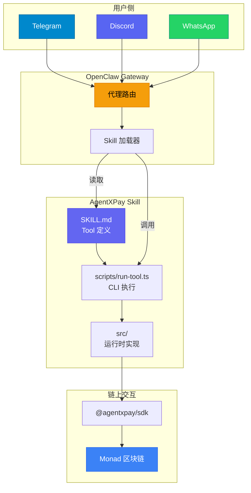
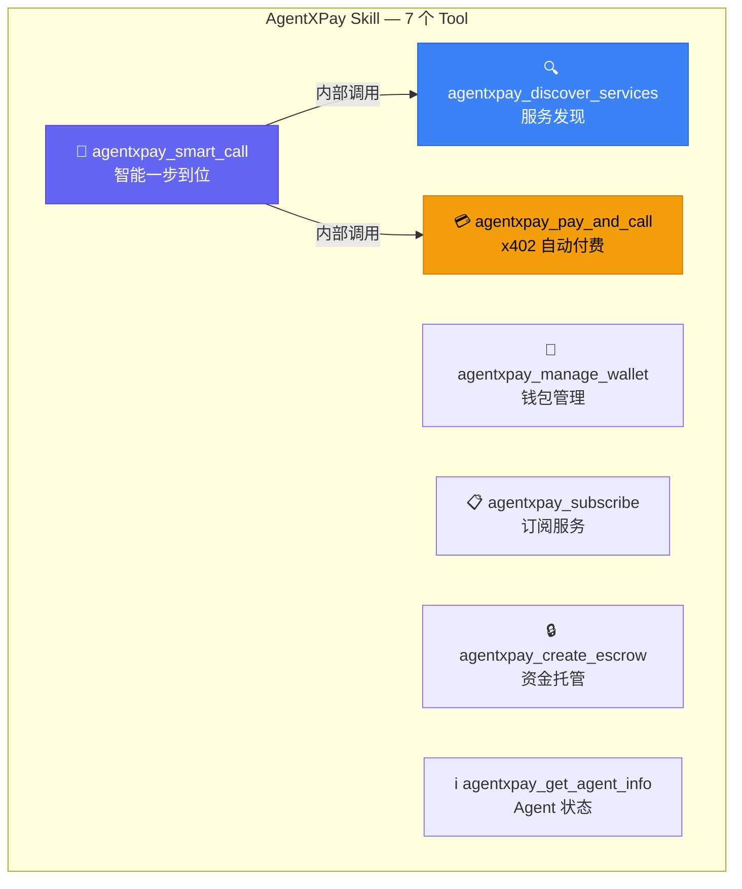
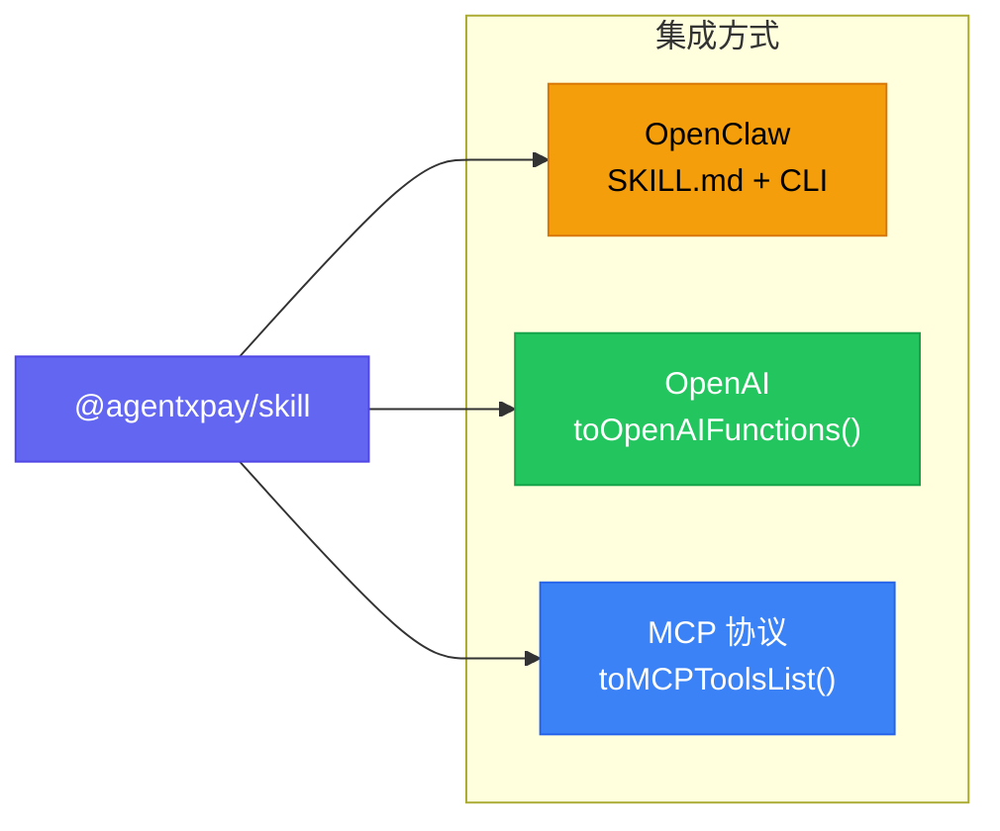
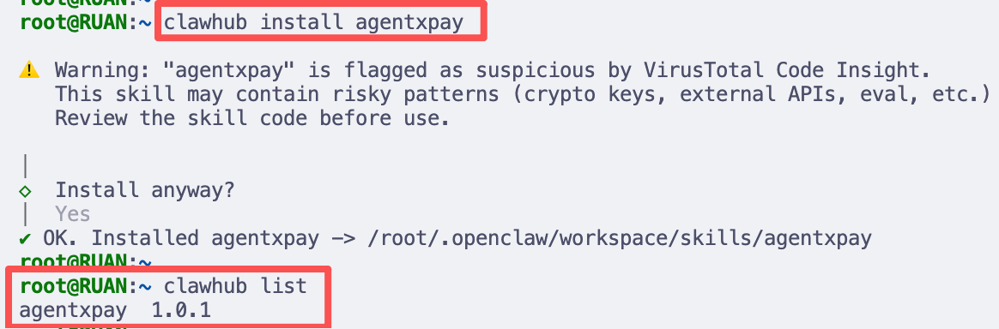
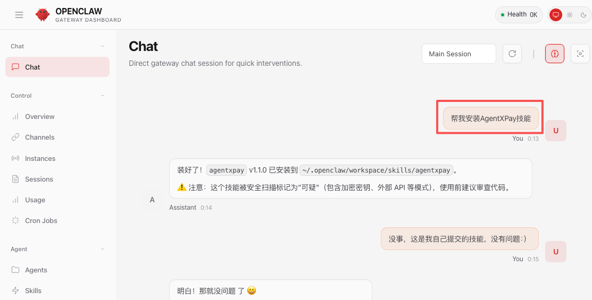
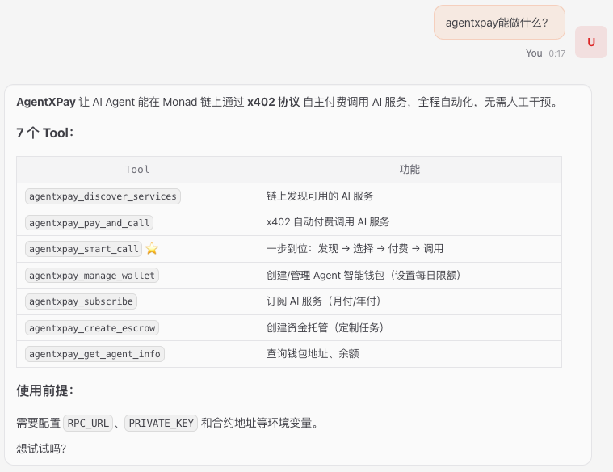
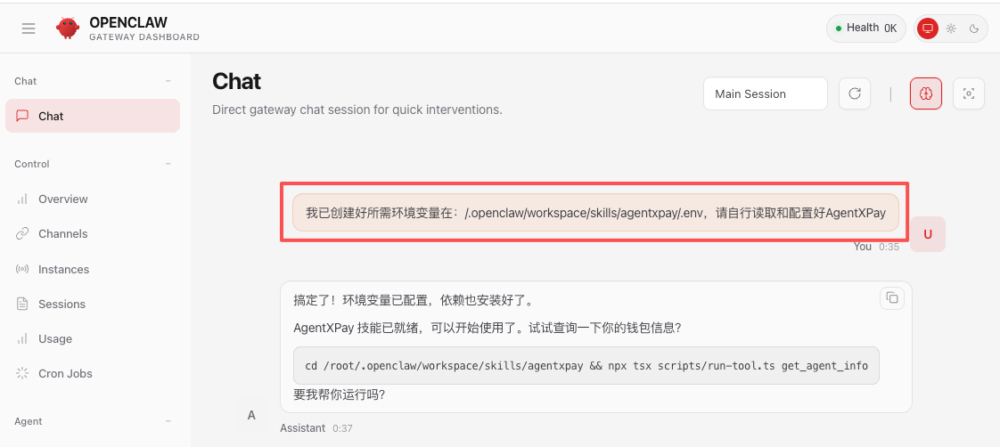
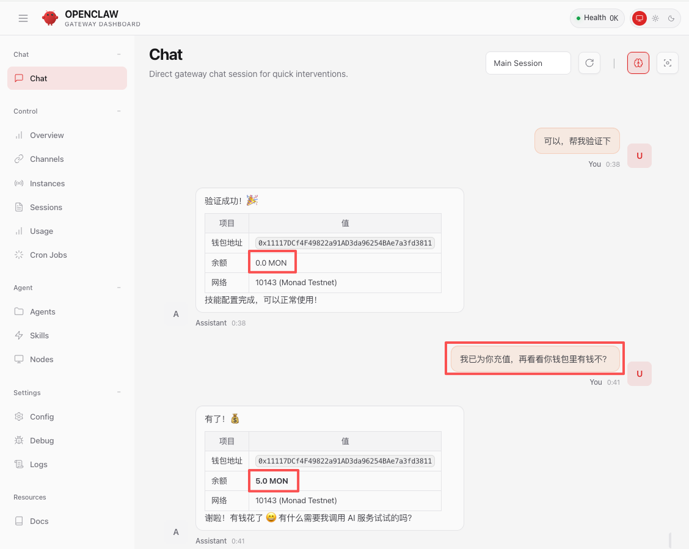

# AgentXPay Skill 接入 OpenClaw 手册

> 本手册指导如何将 `@agentxpay/skill` 接入 [OpenClaw](https://openclaw.ai) 平台，使 AI 代理通过聊天界面（Telegram/Discord/WhatsApp 等）直接调用链上 AI 服务付费能力。

---

## 目录

[TOC]

---

## 1. 整体架构

- `OpenClaw` 代理自动发现并加载`AgentXPay Skill`
- 用户通过聊天界面直接使用链上 AI 服务付费能力
- 已接入`AgentXPay` 7 个链上支付工具到`OpenClaw`生态




---

## 2. AgentXPay Skill 架构

### 7 个 Tool 概览



### 多平台兼容

Skill 同时支持三种集成方式：



---

## 3. 目录结构调整

### 当前结构

```
agentxpay/
├── SKILL.md                # ✅ 核心定义
├── scripts/
│   └── run-tool.ts         # ✅ CLI 执行入口
├── references/
│   ├── sdk-api.md          # ✅ SDK API 参考
│   └── x402-protocol.md    # ✅ x402 协议规范
├── src/
│   ├── index.ts            # 统一导出 + 适配器
│   ├── runtime.ts          # 7 个 Tool 的运行时实现
│   ├── schemas.ts          # JSON Schema 定义
│   └── types.ts            # 类型定义
├── dist/                   # 构建产物
├── __tests__/              # 测试
└── package.json
```

### OpenClaw 安装后的位置

```
~/.openclaw/workspace/skills/agentxpay/
├── SKILL.md
├── scripts/run-tool.ts
├── references/
├── src/
├── dist/
└── package.json
```

> **注意**：Agent Skills 规范要求 `name` 与目录名匹配。安装时目录名使用 `agentxpay`。

---

## 4. openclaw.json 配置

用户安装 Skill 后，需在 `~/.openclaw/openclaw.json` 中配置环境变量和选项，亦或直接让`OpenClaw`为你配置。

```json
{
  "skills": {
    "entries": {
      "agentxpay": {
        "enabled": true,
        "env": {
          "RPC_URL": "https://testnet-rpc.monad.xyz/",
          "PRIVATE_KEY": "YOUR_AGENT_PRIVATE_KEY",
          "SERVICE_REGISTRY_ADDRESS": "0x6F9679BdF5F180a139d01c598839a5df4860431b",
          "PAYMENT_MANAGER_ADDRESS": "0xf4AE7E15B1012edceD8103510eeB560a9343AFd3",
          "SUBSCRIPTION_MANAGER_ADDRESS": "0x0bF7dE8d71820840063D4B8653Fd3F0618986faF",
          "ESCROW_ADDRESS": "0xc981ec845488b8479539e6B22dc808Fb824dB00a",
          "AGENT_WALLET_FACTORY_ADDRESS": "0x5E5713a0d915701F464DEbb66015adD62B2e6AE9"
        },
        "config": {
          "network": "testnet"
        }
      }
    }
  }
}
```

### 配置项说明

| 字段 | 说明 |
|------|------|
| `enabled` | 是否启用此 Skill |
| `env` | 环境变量注入，仅在进程未设置时生效 |
| `config` | 自定义字段，可在脚本中通过环境变量读取 |

### 环境变量说明

| 变量 | 必需 | 说明 | 影响的 Tool |
|------|------|------------|------------|
| `RPC_URL` | **是** | 链网络URL | 所有 |
| `PRIVATE_KEY` | **是** | Agent身份私钥 | 所有 |
| `SERVICE_REGISTRY_ADDRESS` | **是** | 服务注册合约地址 | discover_services, smart_call |
| `PAYMENT_MANAGER_ADDRESS` | **是** | 支付管理合约地址 | pay_and_call, smart_call |
| `SUBSCRIPTION_MANAGER_ADDRESS` | 否 | 订阅管理合约地址 | subscribe |
| `ESCROW_ADDRESS` | 否 | 托管合约地址 | create_escrow |
| `AGENT_WALLET_FACTORY_ADDRESS` | 否 | Agent钱包工厂合约地址 | manage_wallet (create) |

---

## 5. 安装与配置AgentXPay技能

### 安装AgentXPay技能

- **通过命令**

```
clawhub install agentxpay
```



- **通过提示词**



### 查看技能功能



### 配置技能环境变量

可以采用 [4. openclaw.json 配置](#4. openclaw.json 配置) 修改配置文件的方式进行配置，也可以直接创建`.env`文件，写入环境变量，让OpenClaw自己去读取和配置。

例如，创建`~/.openclaw/workspace/skills/agentxpay/.env`文件，包含以下内容：

> 私钥对应我当前的`ClawAgent`钱包地址为：`0x11117DCf4F49822a91AD3da96254BAe7a3fd3811`。

```sh
RPC_URL=https://testnet-rpc.monad.xyz/
PRIVATE_KEY=YOUR_AGENT_PRIVATE_KEY
SERVICE_REGISTRY_ADDRESS=0x6F9679BdF5F180a139d01c598839a5df4860431b
PAYMENT_MANAGER_ADDRESS=0xf4AE7E15B1012edceD8103510eeB560a9343AFd3
SUBSCRIPTION_MANAGER_ADDRESS=0x0bF7dE8d71820840063D4B8653Fd3F0618986faF
ESCROW_ADDRESS=0xc981ec845488b8479539e6B22dc808Fb824dB00a
AGENT_WALLET_FACTORY_ADDRESS=0x5E5713a0d915701F464DEbb66015adD62B2e6AE9
```

### 让OpenClaw自行配置

```
提示词：我已创建好所需环境变量在：/.openclaw/workspace/skills/agentxpay/.env，请自行读取和配置好AgentXPay
```



### 验证技能安装是否成功

查询下地址是否有钱，验证技能安装是否成功。初始地址没有钱，充值后成功获取到金额，符合预期。



## 6. 使用AgentXPay技能

